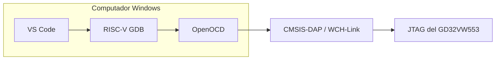

# 1. Hardware y cadena de herramientas

## Hardware requerido

- placa basada en GD32VW553HMQ6 o GD32VW553HMQ7;
- cable USB de datos;
- depurador compatible con CMSIS-DAP/JTAG, por ejemplo WCH-Link;
- conexión JTAG entre el depurador y la placa;
- computador con Windows 10 u 11.

Para **programar y depurar con OpenOCD** se conecta el depurador a la placa y el
depurador al PC. El modo UART del programador oficial es un flujo diferente y
no se utiliza en esta plantilla.

## Función de cada componente

| Componente | Responsabilidad |
| --- | --- |
| VS Code | Edición, tareas y interfaz de depuración. |
| C/C++ | IntelliSense, navegación y análisis del código C. |
| CMake Tools | Integración de CMake dentro de VS Code. |
| Cortex-Debug | Conecta VS Code con GDB y OpenOCD. |
| CMake | Describe fuentes, opciones, includes y proceso de enlace. |
| Ninja | Ejecuta rápidamente las reglas generadas por CMake. |
| Nuclei GCC | Compila C/ASM y enlaza para RISC-V RV32. |
| GDB | Controla breakpoints, memoria, registros y ejecución. |
| OpenOCD | Comunica GDB/programación con el depurador físico. |
| SDK GD32VW55x | Startup, drivers, encabezados, sistema y linker script. |

## Dos conexiones que no deben confundirse

| Flujo | Conexión | Uso |
| --- | --- | --- |
| OpenOCD | PC → depurador → JTAG de la placa | Flash y breakpoints. |
| Bootloader UART | PC → USB/UART de la placa | Programación por el bootloader. |

Este repositorio implementa el primer flujo.

## Arquitectura del proceso

## Precauciones básicas

- confirme tierra común entre depurador y placa;
- no conecte señales a tensiones incompatibles;
- cierre otras instancias de OpenOCD antes de comenzar una depuración;
- no desconecte el hardware durante una escritura de flash;
- si usa un depurador distinto, verifique su interfaz y archivo `.cfg`.
