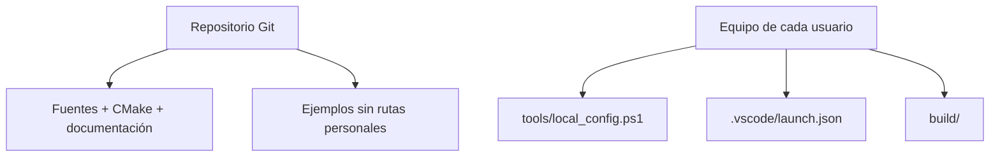

# 3. Estructura del proyecto

## Árbol de archivos

```text
.
├── .vscode/
│   ├── extensions.json
│   ├── launch.example.json
│   └── tasks.json
├── Doc/
├── Inc/
│   └── gd32vw55x_libopt.h
├── Src/
│   └── main.c
├── cmake/
│   ├── generate_listing.cmake
│   └── toolchain-riscv.cmake
├── tools/
│   ├── configure.ps1
│   ├── create_debug_config.ps1
│   ├── create_project.ps1
│   ├── flash.ps1
│   ├── local_config.example.ps1
│   └── verify_environment.ps1
├── .gitignore
├── CMakeLists.txt
├── CMakePresets.json
└── README.md
```

## Responsabilidad de cada zona

| Ruta | Contenido |
| --- | --- |
| `Src/` | Fuentes propios `.c`, `.S` o `.s`. |
| `Inc/` | Encabezados propios `.h`. |
| `cmake/` | Selección del compilador y funciones auxiliares. |
| `tools/` | Automatización en PowerShell. |
| `.vscode/` | Tareas, extensiones y configuración de depuración. |
| `Doc/` | Manual que acompaña el proyecto. |
| `build/` | Salida generada; no se edita ni se publica. |

## Archivos versionados y locales



Los tres elementos inferiores están en `.gitignore`. Así, otra persona puede
clonar el proyecto sin recibir rutas del computador original ni artefactos
obsoletos.

## Dónde agregar código

- fuente C: agréguelo a `Src/` y a `APP_SOURCES` en `CMakeLists.txt`;
- ensamblador: use extensión `.S` y agréguelo también a `APP_SOURCES`;
- encabezado: guárdelo en `Inc/`;
- módulo del SDK: incluya el encabezado requerido en
  `Inc/gd32vw55x_libopt.h` si el SDK lo necesita;
- biblioteca adicional: declare sus fuentes, includes y definiciones en
  `CMakeLists.txt`.

Ejemplo:

```cmake
set(APP_SOURCES
    Src/main.c
    Src/uart_console.c
    Src/crc_riscv.S
    "${UTILITIES_DIR}/gd32vw553h_eval.c"
    "${PERIPHERAL_DIR}/system_gd32vw55x.c"
)
```

## Qué no se debe copiar desde GD32 Embedded Builder

No copie `.o`, `.d`, `.elf`, `.map`, `objects.list`, `sources.mk` ni
`subdir.mk`. Son resultados o metadatos del sistema anterior. CMake debe partir
de fuentes, encabezados, linker script y opciones de compilación.
