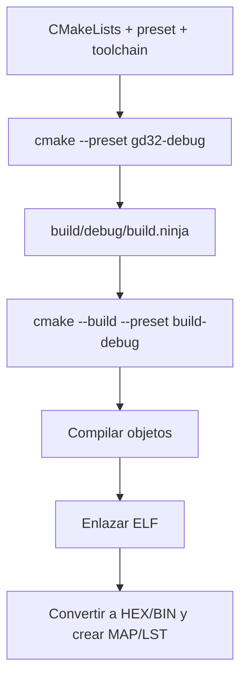

# 4. CMake explicado

## Qué hace CMake y qué hace Ninja

CMake **configura y genera** el sistema de construcción. Ninja **ejecuta** las
reglas generadas. El compilador Nuclei transforma fuentes RISC-V en objetos y el
enlazador construye el ELF.



## Orden importante

El archivo de toolchain debe seleccionarse antes de `project()`. Por eso
`CMakePresets.json` define `CMAKE_TOOLCHAIN_FILE`. No se debe establecer el
compilador después de que CMake haya detectado uno diferente.

## Presets

Hay dos configuraciones:

| Preset | Carpeta | Optimización | Uso |
| --- | --- | --- | --- |
| `gd32-debug` | `build/debug` | `-Og`, símbolos `-g3` | Breakpoints y aprendizaje. |
| `gd32-release` | `build/release` | `-Os` | Tamaño reducido. |

`CMakePresets.json` sí se publica porque es común al proyecto.
`CMakeUserPresets.json`, si se usa, es privado porque puede contener rutas
locales.

## Toolchain RISC-V

`cmake/toolchain-riscv.cmake`:

1. declara un sistema genérico embebido;
2. evita que CMake intente ejecutar programas RISC-V en Windows;
3. localiza `riscv-nuclei-elf-gcc`;
4. asigna compilador C y ASM;
5. asigna `ar`, `ranlib`, `objcopy`, `objdump` y `size`.

La línea siguiente es esencial:

```cmake
set(CMAKE_TRY_COMPILE_TARGET_TYPE STATIC_LIBRARY)
```

Durante la detección del compilador, CMake crea una prueba secundaria. El
script `configure.ps1` exporta las rutas como variables de entorno para que esa
prueba también encuentre el toolchain.

## Arquitectura y ABI

```cmake
-march=rv32imafdc
-mabi=ilp32d
-mcmodel=medany
```

- `rv32`: registros de propósito general de 32 bits;
- `i`: conjunto entero base;
- `m`: multiplicación y división;
- `a`: operaciones atómicas;
- `f` y `d`: coma flotante simple y doble;
- `c`: instrucciones comprimidas;
- `ilp32d`: ABI usada por el firmware y las bibliotecas del proyecto.

Estas opciones deben coincidir al compilar y enlazar. Cambiarlas sin comprobar
el SDK puede producir objetos incompatibles.

## Linker script

`GD32VW553xM.lds` define regiones de memoria y la ubicación de las secciones:

| Sección | Contenido típico |
| --- | --- |
| `.text` | instrucciones y constantes de solo lectura; normalmente flash. |
| `.data` | variables inicializadas; imagen en flash y ejecución en RAM. |
| `.bss` | variables inicializadas en cero; RAM. |
| pila | llamadas, variables automáticas y contexto. |
| heap | memoria dinámica, si la aplicación la utiliza. |

El enlazador también produce `GD32VW55x.map`, útil para revisar qué símbolos
ocupan memoria.

## Fuentes del SDK

La plantilla referencia:

- `system_gd32vw55x.c`;
- `Utilities/gd32vw553h_eval.c`;
- drivers en `GD32VW55x_standard_peripheral/Source`;
- startup, entorno y stubs de `Firmware/RISCV`;
- linker script del proyecto Eclipse suministrado por el SDK.

El `foreach(REQUIRED_PATHS)` detiene la configuración con un mensaje claro si
una ruta no corresponde al SDK esperado.

## Artefactos posteriores al enlace

`add_custom_command(... POST_BUILD)` ejecuta:

- `objcopy -O ihex` para el HEX;
- `objcopy -O binary` para el BIN;
- `size` para el resumen de memoria;
- `objdump -h -S` para el LST.

El ELF es el archivo preferido para OpenOCD y GDB porque conserva secciones,
direcciones y símbolos de depuración.
