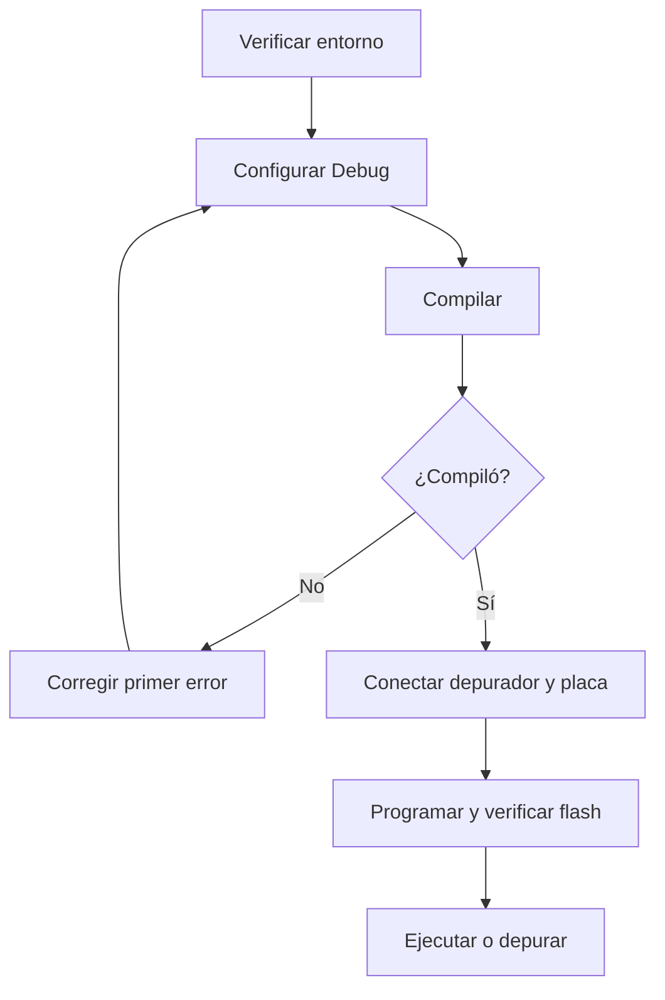

# 6. Compilar, programar y depurar

## Flujo completo



## 6.1 Configurar

```powershell
powershell -NoProfile -ExecutionPolicy Bypass `
  -File .\tools\configure.ps1 -BuildType Debug
```

Resultado esperado:

```text
-- Configuring done
-- Generating done
-- Build files have been written to: .../build/debug
```

## 6.2 Compilar

```powershell
cmake --build --preset build-debug
```

La primera compilación procesa todos los archivos. Si no cambió nada, Ninja
responde `no work to do`; eso es correcto. Después de modificar y guardar
`Src/main.c`, debe recompilar al menos ese archivo y volver a enlazar.

Para confirmar los resultados:

```powershell
Get-ChildItem .\build\debug\GD32VW55x.*
```

## 6.3 Programar

Conecte WCH-Link/CMSIS-DAP al PC y a JTAG de la placa. Después ejecute:

```powershell
powershell -NoProfile -ExecutionPolicy Bypass `
  -File .\tools\flash.ps1 -BuildType Debug
```

La configuración validada físicamente con WCH-Link CMSIS-DAP v2 es:

```text
cmsis_dap_backend usb_bulk
cmsis_dap_vid_pid 0x1a86 0x8012
transport select jtag
adapter speed 50
```

Los `flash.ps1` suministrados aplican estos valores. A 100 kHz el probe llegó
a devolver una cadena JTAG inválida; a 50 kHz reconoció los TAP Nuclei y
GigaDevice, programó, verificó y reinició la placa.

Las señales principales de éxito son:

```text
** Programming Finished **
** Verified OK **
** Resetting Target **
```

Una advertencia automática sobre el segundo TAP JTAG o la estimación de flash
puede aparecer con la configuración suministrada por el fabricante. Lo
determinante es que programación y verificación finalicen correctamente.

## 6.4 Probar el firmware mínimo

El LED conectado a PC13 debe alternar aproximadamente dos veces por segundo.
En placas con LED activo en bajo, el significado eléctrico de encendido y
apagado está invertido, pero el parpadeo se conserva.

Para demostrar que VS Code recompila y programa el cambio:

1. cambie `busy_wait_delay_ms(500U)` por `busy_wait_delay_ms(1500U)`;
2. guarde el archivo;
3. ejecute `Build + Flash GD32`;
4. compruebe que cada estado dura cerca de 1.5 s.

## 6.5 Crear la configuración de depuración

Ejecute una vez por computador/proyecto:

```powershell
powershell -NoProfile -ExecutionPolicy Bypass `
  -File .\tools\create_debug_config.ps1
```

Esto genera `.vscode/launch.json` con GDB, OpenOCD y sus scripts.

## 6.6 Breakpoints

1. Abra `Src/main.c`.
2. Haga clic en el margen izquierdo de la línea
   `gpio_bit_toggle(LED_GPIO_PORT, LED_GPIO_PIN);`.
3. Abra **Run and Debug**.
4. Seleccione `Debug GD32VW553 - Cortex Debug`.
5. Presione `F5`.

El programa se detendrá antes de cambiar PC13. Utilice:

| Control | Acción |
| --- | --- |
| Continue / `F5` | Sigue hasta el siguiente breakpoint. |
| Step Over / `F10` | Ejecuta la línea sin entrar en la función llamada. |
| Step Into / `F11` | Intenta entrar en la función llamada. |
| Step Out / `Shift+F11` | Termina la función actual. |
| Restart | Reinicia la sesión. |
| Stop | Cierra GDB y OpenOCD. |

En código optimizado algunas líneas pueden fusionarse o no tener una dirección
independiente. Use la configuración Debug (`-Og -g3`) para una experiencia más
predecible.

## 6.7 Qué observar

- **Variables:** locales y globales visibles en el punto de parada;
- **Watch:** expresiones añadidas manualmente;
- **Call Stack:** cadena de funciones activas;
- **Registers:** registros RISC-V;
- **Breakpoints:** lista y estado de puntos de parada;
- **Disassembly:** instrucciones reales cuando el mapeo C no es suficiente.

No deje simultáneamente una tarea de flash y una sesión de depuración usando el
mismo depurador.
