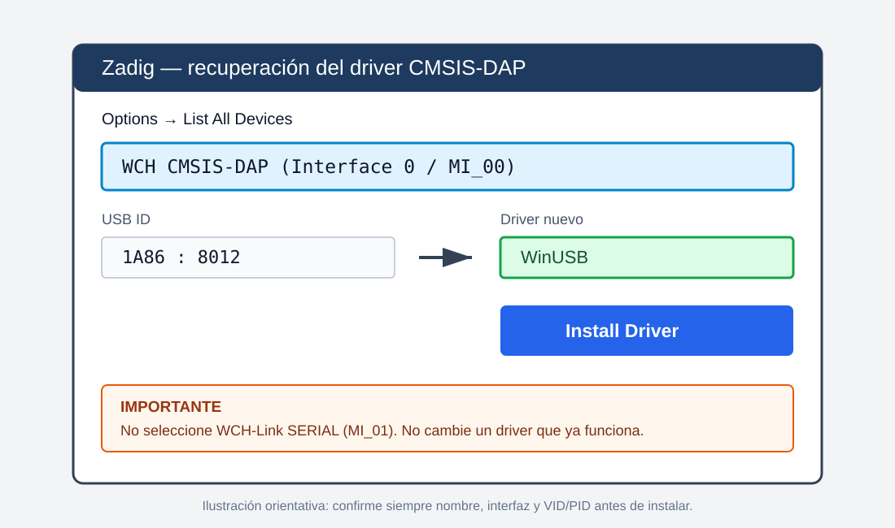

# 11. VS Code y reconocimiento de la placa, desde cero

## 11.1 Identifique los dos USB posibles

| Dispositivo | Cómo aparece | Uso |
| --- | --- | --- |
| WCH-Link/CMSIS-DAP | dispositivo USB de depuración y a veces COM | JTAG, OpenOCD, GDB |
| CH340 de la placa | `USB-SERIAL CH340 (COMx)` | UART opcional; no se usa para Blink Polling |

Blink Polling y los ejercicios 00–11 usan JTAG/OpenOCD. El ejercicio 12 validado
también se programa mediante WCH-Link/OpenOCD; su capítulo explica la imagen
MBL+MSDK especial.

## 11.2 Comprobación física

1. Use cable USB de datos, no uno exclusivo de carga.
2. Una GND del probe con GND de la placa.
3. Conecte las señales JTAG según el pinout de la placa.
4. Mantenga lógica de 3,3 V.
5. Conecte primero el probe y luego la alimentación de la placa.
6. No cambie BOOT0 al azar; siga el flujo del ejercicio.

## 11.3 Comprobar Windows

Presione `Win+X` y abra **Administrador de dispositivos**. Revise:

- Puertos (COM y LPT): CH340 o interfaz serial del probe;
- Dispositivos USB: CMSIS-DAP/WCH-Link;
- ausencia de triángulos amarillos.

Desde PowerShell:

```powershell
Get-PnpDevice -PresentOnly |
    Where-Object FriendlyName -Match "WCH|CMSIS|CH340|USB-SERIAL" |
    Format-Table Status, Class, FriendlyName, InstanceId -AutoSize
```

Para enumerar puertos:

```powershell
[System.IO.Ports.SerialPort]::GetPortNames()
```

Si no aparece nada, cambie cable y puerto USB antes de modificar código.

En el equipo validado, Windows mostró simultáneamente:

```text
WCH CMSIS-DAP
WCH-Link SERIAL (COM9)
USB\VID_1A86&PID_8012
```

El COM puede cambiar entre computadores; el identificador USB del probe es el
dato usado por OpenOCD.

## 11.4 Instalar VS Code y extensiones

1. Descargue VS Code desde `https://code.visualstudio.com/`.
2. Instale para todos los usuarios o recuerde la ruta elegida.
3. Abra Extensions con `Ctrl+Shift+X`.
4. Instale:
   - C/C++ (`ms-vscode.cpptools`);
   - CMake Tools (`ms-vscode.cmake-tools`);
   - Cortex-Debug (`marus25.cortex-debug`).
5. Reinicie VS Code.
6. Abra **File > Open Folder** y seleccione la raíz exacta del ejercicio.
7. Acepte Workspace Trust únicamente para estos repositorios conocidos.

## 11.4.1 Driver USB y uso seguro de Zadig

Primero conecte el WCH-Link y pruebe el driver instalado por el fabricante. Si
Windows muestra `WCH CMSIS-DAP` con estado **OK** y OpenOCD logra encontrarlo,
**no use Zadig**.

Use Zadig únicamente si se cumplen simultáneamente estas condiciones:

- el WCH-Link aparece físicamente conectado;
- cable y puerto USB ya fueron descartados;
- OpenOCD informa `unable to find a matching CMSIS-DAP device`;
- el Administrador de dispositivos muestra la interfaz CMSIS-DAP sin un driver
  utilizable.

Procedimiento de recuperación:

1. Descargue Zadig desde <https://zadig.akeo.ie/>.
2. Ejecútelo como administrador.
3. Active **Options > List All Devices**.
4. Seleccione exactamente `WCH CMSIS-DAP`, interfaz `MI_00` o Interface 0.
5. Confirme el identificador `VID 1A86` y `PID 8012`.
6. Seleccione `WinUSB` como driver de destino.
7. Pulse **Install Driver** o **Replace Driver**.
8. Desconecte y reconecte el WCH-Link.
9. Ejecute nuevamente **Verify GD32 Environment** y la tarea de flash.



**No seleccione `WCH-Link SERIAL`, `MI_01`, el teclado, el ratón ni otro USB.**
Cambiar la interfaz equivocada puede eliminar el puerto COM o afectar otro
dispositivo. Si el puerto serial desaparece, reinstale el driver oficial WCH
desde Administrador de dispositivos; no siga reemplazando interfaces al azar.

## 11.5 Instalar y verificar programas

Instale todo bajo `C:\gd32_tools` y agregue al PATH las cuatro rutas indicadas
en [02_INSTALLATION_WINDOWS.md](02_INSTALLATION_WINDOWS.md).

```powershell
git --version
cmake --version
ninja --version
code --version
```

Localice ejecutables del fabricante:

```powershell
Get-ChildItem "C:\" -Filter "riscv-nuclei-elf-gcc.exe" -Recurse -ErrorAction SilentlyContinue
Get-ChildItem "C:\" -Filter "riscv-nuclei-elf-gdb.exe" -Recurse -ErrorAction SilentlyContinue
Get-ChildItem "C:\" -Filter "openocd.exe" -Recurse -ErrorAction SilentlyContinue
```

La búsqueda completa de `C:\` puede tardar. Si conoce la carpeta de Embedded
Builder, úsela como raíz para acelerar.

## 11.6 Configurar rutas locales

Desde el explorador lateral de VS Code:

1. Expanda la carpeta `tools`.
2. Seleccione `local_config.example.ps1`.
3. Use copiar y pegar desde el menú contextual.
4. Cambie el nombre de la copia a `local_config.ps1`.
5. Abra la copia en el editor.

Complete con barras `/` o rutas PowerShell válidas:

```powershell
$GD32_SDK_ROOT = "C:/gd32_tools/GD32VW55x_Firmware_Library_V1.6.0"
$GD32_MSDK_ROOT = "C:/gd32_tools/GD32VW55x_RELEASE_V1.0.3g"
$NUCLEI_TOOLCHAIN_DIR = "C:/gd32_tools/nuclei/bin"
$OPENOCD_ROOT = "C:/gd32_tools/openocd"
```

`OPENOCD_ROOT` debe contener `bin` y `scripts`. No publique
`local_config.ps1`; posee rutas personales y está ignorado por Git.

`GD32_SDK_ROOT` se usa para las variantes original y Assembly;
`GD32_MSDK_ROOT`, para FreeRTOS.

## 11.7 Verificación desde VS Code

1. Abra `Terminal > Run Task`.
2. Seleccione `Verify GD32 Environment`.
3. Corrija el primer elemento marcado como faltante.
4. Ejecute `Configure GD32 Debug`.
5. Ejecute `Build GD32 Debug`.
6. Conecte la placa y ejecute `Flash GD32 Debug`.

Durante `Flash GD32 Debug`, la prueba correcta muestra
`Examined RISC-V core; found 1 harts`. Si aparece
`all ones`, revise alimentación, GND, TCK, TMS, TDI y TDO antes de cambiar
software o controladores.

La configuración comprobada para este WCH-Link es CMSIS-DAP v2 mediante
`usb_bulk`, VID/PID `1A86:8012`, JTAG y velocidad de 50 kHz.

## 11.8 Ejecutar las tres variantes de cada ejercicio

1. Abra `Terminal > Run Task`.
2. Seleccione **Build + Flash Original** para la referencia.
3. Espere `Verified OK` y compruebe la evidencia física.
4. Abra nuevamente `Terminal > Run Task`.
5. Seleccione **Build + Flash Assembly**.
6. Repita la comprobación.
7. Abra nuevamente `Terminal > Run Task`.
8. Seleccione **Build + Flash FreeRTOS**.
9. Espere la compilación completa del MSDK y `Verified OK`.

La tarea FreeRTOS de los ejercicios actualizados ya incluye la limpieza al
cambiar de aplicación.

## 11.9 Configurar depuración F5

Abra `Terminal > Run Task`, ejecute **Create Debug Configuration**, abra
**Run and Debug**, seleccione la configuración GD32 y presione `F5`.
El flujo correcto es:

```text
VS Code -> Cortex-Debug -> GDB RISC-V -> OpenOCD -> CMSIS-DAP -> JTAG -> MCU
```

No seleccione un depurador genérico de C/C++ para escritorio; intentaría abrir
`a.exe` y no entiende el microcontrolador.

## 11.10 Diagnóstico por capas

1. **Windows no ve USB:** cable, alimentación o driver.
2. **Windows ve USB, OpenOCD no:** interfaz, driver, puerto ocupado o ruta cfg.
3. **OpenOCD ve probe, no target:** JTAG, tierra, alimentación o velocidad.
4. **Flash funciona, F5 no:** ruta de GDB/ELF o `launch.json`.
5. **F5 funciona, breakpoint no:** optimización, fuente/ELF distintos o línea sin instrucción.
6. **Firmware corre, resultado no:** lógica, pin, polaridad o clock.

No cambie simultáneamente drivers, CMake y código: pruebe una capa cada vez.
