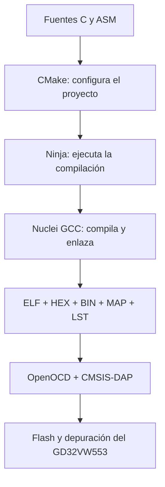

# GD32VW553 con Visual Studio Code y CMake

**Autora:** Laura Daniela Barragán Silva  
**Plataforma validada:** GD32VW553HMQ6/HMQ7  
**Arquitectura:** Nuclei RISC-V RV32  
**Sistema anfitrión:** Windows 10/11  
**Entorno:** VS Code, CMake, Ninja, Nuclei RISC-V GCC y OpenOCD

## Propósito

Este repositorio es una guía reproducible y una plantilla mínima para crear,
compilar, programar y depurar proyectos del GD32VW553 desde Visual Studio Code.
No sustituye el SDK oficial: lo referencia desde una ruta local que nunca se
publica en GitHub.

Al terminar la configuración podrá:

- compilar fuentes C y ensamblador RISC-V;
- generar `ELF`, `HEX`, `BIN`, `MAP` y `LST` con CMake;
- programar la placa con OpenOCD y un depurador CMSIS-DAP/WCH-Link;
- usar breakpoints, ejecución paso a paso, registros y variables en VS Code;
- crear proyectos nuevos a partir de esta plantilla.

## Cadena de herramientas



## Ruta rápida

1. Instale los componentes descritos en [Doc/02_INSTALLATION_WINDOWS.md](Doc/02_INSTALLATION_WINDOWS.md).
2. Copie `tools/local_config.example.ps1` como `tools/local_config.ps1`.
3. Cambie sus tres rutas locales.
4. Abra **esta carpeta**, no su carpeta superior, en VS Code.
5. Acepte **Trust this folder** si confía en el contenido descargado.
6. Ejecute `Terminal > Run Task > Verify GD32 Environment`.
7. Ejecute `Terminal > Run Task > Build + Flash GD32`.
8. Compruebe que el LED de PC13 cambia de estado.
9. Ejecute `Create Debug Configuration` y después presione `F5` para depurar.

## Comandos equivalentes

Desde PowerShell, ubicado en la raíz del repositorio:

```powershell
Copy-Item .\tools\local_config.example.ps1 .\tools\local_config.ps1
notepad .\tools\local_config.ps1
powershell -NoProfile -ExecutionPolicy Bypass -File .\tools\verify_environment.ps1
powershell -NoProfile -ExecutionPolicy Bypass -File .\tools\configure.ps1 -BuildType Debug
cmake --build --preset build-debug
powershell -NoProfile -ExecutionPolicy Bypass -File .\tools\flash.ps1 -BuildType Debug
```

## Resultado de la prueba mínima

El archivo `Src/main.c` configura PC13 como salida y alterna su nivel
aproximadamente cada 500 ms. La espera activa solo se utiliza para comprobar la
cadena completa. No pretende ser una arquitectura recomendada para aplicaciones
reales.

## Archivos generados

Después de compilar aparecen en `build/debug/`:

| Archivo | Finalidad |
| --- | --- |
| `GD32VW55x.elf` | Ejecutable con símbolos; se programa y se depura. |
| `GD32VW55x.hex` | Imagen Intel HEX para programadores compatibles. |
| `GD32VW55x.bin` | Imagen binaria sin metadatos ni direcciones. |
| `GD32VW55x.map` | Mapa del enlace: símbolos, secciones y memoria. |
| `GD32VW55x.lst` | Código fuente mezclado con desensamblado. |

## Documentación

| Documento | Contenido |
| --- | --- |
| [01_HARDWARE_AND_TOOLS](Doc/01_HARDWARE_AND_TOOLS.md) | Placa, depurador y función de cada herramienta. |
| [02_INSTALLATION_WINDOWS](Doc/02_INSTALLATION_WINDOWS.md) | Instalación y localización de rutas. |
| [03_PROJECT_STRUCTURE](Doc/03_PROJECT_STRUCTURE.md) | Estructura del repositorio y archivos locales. |
| [04_CMAKE_EXPLAINED](Doc/04_CMAKE_EXPLAINED.md) | Toolchain, presets, fuentes, enlace y artefactos. |
| [05_VSCODE_CONFIGURATION](Doc/05_VSCODE_CONFIGURATION.md) | Extensiones, tareas e IntelliSense. |
| [06_BUILD_FLASH_DEBUG](Doc/06_BUILD_FLASH_DEBUG.md) | Compilar, programar y depurar paso a paso. |
| [07_CREATE_NEW_PROJECT](Doc/07_CREATE_NEW_PROJECT.md) | Crear un proyecto nuevo desde la plantilla. |
| [08_TROUBLESHOOTING](Doc/08_TROUBLESHOOTING.md) | Diagnóstico de errores frecuentes. |

## Estructura principal

```text
GD32VW553_VSCode_CMake_Guide/
├── .vscode/              # tareas, extensiones y ejemplo de depuración
├── Doc/                  # guía detallada
├── Inc/                  # encabezados propios
├── Src/                  # aplicación mínima
├── cmake/                # toolchain y generación del listado
├── tools/                # scripts de configuración, flash y diagnóstico
├── CMakeLists.txt        # descripción del firmware
├── CMakePresets.json     # configuraciones Debug y Release
└── README.md
```

## Dependencias externas y privacidad

El SDK, el compilador y OpenOCD no se copian en este repositorio. Cada persona
configura sus rutas en `tools/local_config.ps1`; ese archivo está ignorado por
Git. También se excluyen `build/` y `.vscode/launch.json`, porque contienen
resultados generados o rutas locales.

## Referencias oficiales

- [GigaDevice: familia GD32VW553](https://www.gigadevice.com/product/mcu/wireless-mcus/gd32vw553-series)
- [Nuclei SDK: placa GD32VW553H-EVAL](https://doc.nucleisys.com/nuclei_sdk/design/board/gd32vw553h_eval.html)
- [CMake: cmake-presets(7)](https://cmake.org/cmake/help/latest/manual/cmake-presets.7.html)
- [Visual Studio Code: depuración](https://code.visualstudio.com/docs/debugtest/debugging)

## Licencia y alcance

La documentación y los archivos de configuración propios pueden reutilizarse
como material académico. Los componentes externos conservan sus respectivas
licencias. Verifique siempre el modelo exacto de la placa y su conexión antes
de programar la memoria.
